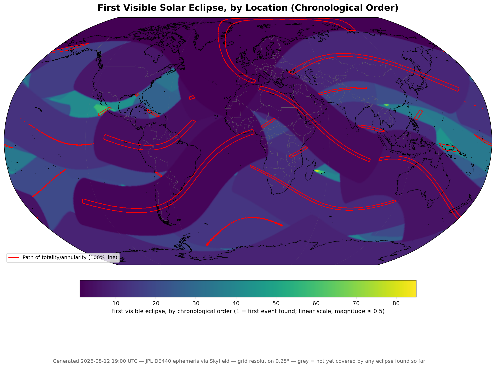

# eclipse-heatmap

A global heat map of **days until the next visible solar eclipse**, computed
from the JPL DE440 ephemeris via Skyfield.


## What it does

For every point on a lat/lon grid, we find the first future solar eclipse
(partial, annular, or total) that meets a minimum magnitude, and record
how many days from today that is.

The search keeps finding eclipses further
into the future, rendering the map after every single one, until either
every grid point is covered or you stop it.

## Install

```bash
python3.11 -m venv .venv        # 3.12 also fine
source .venv/bin/activate
pip install -e .
```

## Run

```bash
python main.py                                            # full open-ended run, all CPU cores
python main.py --resolution 1.0 --end-date 2030-12-31     # bounded, faster
python main.py --magnitude-threshold 0.5 --show-eclipse-paths
python main.py --resolution 2.0 --lat-bounds 60 68 --lon-bounds -25 -13 \
    --start-date 2026-08-01 --end-date 2026-08-20          # quick regional test
```


### CLI options

| Flag | Default | Meaning |
|---|---|---|
| `--resolution` | `0.25` | Grid spacing, degrees |
| `--magnitude-threshold` | `0.01` | Minimum eclipse coverage (0–1) to count as "visible" |
| `--start-date` | today | Search start date, `YYYY-MM-DD` |
| `--end-date` | none | Search end date; omit to run until full coverage or Ctrl+C |
| `--time-step-seconds` | `60` | Time resolution per eclipse window |
| `--workers` | all cores | Worker processes; `1` disables multiprocessing |
| `--data-dir` | `data/` | Ephemeris cache directory |
| `--ephemeris-filename` | `de440.bsp` | Kernel file; `de440s.bsp` is a smaller (~32MB) alternative |
| `--output-dir` | `output/` | Where results are written |
| `--max-eclipses` | none | Stop after N events (debugging) |
| `--lat-bounds MIN MAX` | `-90 90` | Restrict grid latitude |
| `--lon-bounds MIN MAX` | `-180 180` | Restrict grid longitude |
| `--show-eclipse-paths` | off | Draw the totality/annularity boundary on the map |
| `--color-by` | `eclipse_index` | Color map by eclipse rank (linear) or elapsed days (log) |
| `--log-level` | `INFO` | Logging verbosity |

## Outputs

Written to `--output-dir`:

| File | Contents |
|---|---|
| `days_until_next_eclipse.npy` | 2-D array, north-up, NaN = not covered yet |
| `days_until_next_eclipse.tif` | Same data as GeoTIFF, EPSG:4326 |
| `days_until_next_eclipse.csv` | One row per grid point: lat, lon, days, date, type, magnitude, eclipse rank |
| `days_until_next_eclipse.png` | Robinson-projection heat map with colorbar, coastlines, borders |

## Layout

```
main.py                              thin main
pyproject.toml                       package metadata
src/eclipse_heatmap/
  cli.py                             argument parsing
  pipeline.py                        workflow
  models/                            data structures
  science/                           astronomy
  rendering/                         output writers
  utils/                             helpers
```